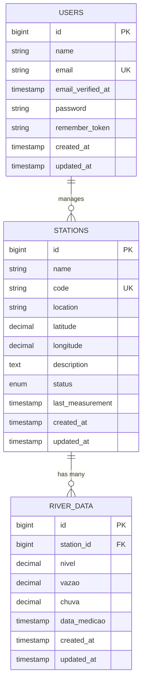
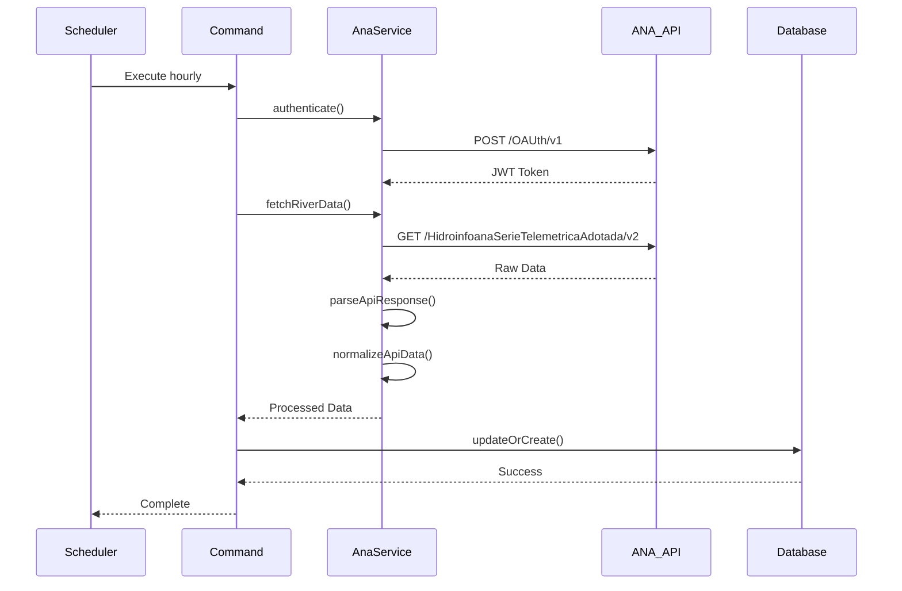

# 🌊 Monitor Rio Piracicaba

Sistema de monitoramento hidrológico em tempo real para o Rio Piracicaba e afluentes no Vale do Aço, Minas Gerais. Desenvolvido com Laravel 10 e integração com a API da Agência Nacional de Águas e Saneamento Básico (ANA).

## 📋 Índice

- [Visão Geral](#-visão-geral)
- [Arquitetura do Sistema](#-arquitetura-do-sistema)
- [Modelo de Dados (MER)](#-modelo-de-dados-mer)
- [Diagrama UML](#-diagrama-uml)
- [Funcionalidades](#-funcionalidades)
- [Tecnologias](#-tecnologias)
- [Instalação](#-instalação)
- [Configuração](#-configuração)
- [API Endpoints](#-api-endpoints)
- [Deploy](#-deploy)
- [Contribuição](#-contribuição)
- [Licença](#-licença)

## 🎯 Visão Geral

O Monitor Rio Piracicaba é uma aplicação web que coleta, processa e visualiza dados hidrológicos em tempo real do Rio Piracicaba e seus afluentes. O sistema integra-se com a API oficial da ANA para obter dados de estações hidrológicas, processa essas informações e apresenta dashboards interativos para monitoramento.

### Objetivos

- **Monitoramento em Tempo Real**: Coleta automática de dados hidrológicos a cada hora
- **Visualização Intuitiva**: Dashboards com gráficos interativos e estatísticas
- **Integração ANA**: Conexão direta com a API oficial da Agência Nacional de Águas
- **Alertas Inteligentes**: Sistema de alertas baseado em níveis críticos
- **Escalabilidade**: Arquitetura preparada para múltiplas estações e rios

## 🎬 Demonstração

### Vídeo de Apresentação

Assista ao vídeo demonstrativo da aplicação para ver todas as funcionalidades em ação:

[](https://youtu.be/3F1Mv8auoHs)

**📺 [Assistir no YouTube](https://youtu.be/3F1Mv8auoHs)**

*Também disponível localmente: [assets/videos/demo-aplicacao.mkv](assets/videos/demo-aplicacao.mkv)*

**Conteúdo do vídeo:**
- 🏠 **Dashboard Principal**: Visão geral das estações e dados em tempo real
- 📊 **Gráficos Interativos**: Visualização de níveis, vazões e chuvas
- 📍 **Mapa de Estações**: Localização geográfica das estações monitoradas
- 📈 **Análises e Estatísticas**: Relatórios detalhados e tendências
- ⚙️ **Configurações**: Gerenciamento de estações e alertas
- 🔄 **Atualização Automática**: Coleta de dados da API da ANA

### Screenshots

<details>
<summary>📸 Ver Screenshots da Aplicação</summary>

#### Dashboard Principal


#### Página de Estações


#### Análises e Gráficos


#### Dados Detalhados


</details>

## 🏗️ Arquitetura do Sistema

### Padrão Arquitetural

O sistema segue o padrão **MVC (Model-View-Controller)** do Laravel com elementos de **Service Layer** e **Repository Pattern**:

```
┌─────────────────┐    ┌─────────────────┐    ┌─────────────────┐
│   Frontend      │    │   Backend       │    │   External      │
│   (Blade/JS)    │◄──►│   (Laravel)     │◄──►│   (ANA API)     │
└─────────────────┘    └─────────────────┘    └─────────────────┘
                              │
                              ▼
                       ┌─────────────────┐
                       │   Database      │
                       │   (SQLite)      │
                       └─────────────────┘
```

### Componentes Principais

1. **Controllers**: Gerenciam requisições HTTP e lógica de apresentação
2. **Models**: Representam entidades do domínio (Station, RiverData)
3. **Services**: Lógica de negócio e integração com APIs externas
4. **Views**: Templates Blade para renderização HTML
5. **Commands**: Tarefas agendadas para coleta automática de dados
6. **Migrations**: Estrutura do banco de dados versionada

## 🗄️ Modelo de Dados (MER)

### Diagrama Entidade-Relacionamento



### Descrição das Entidades

#### STATIONS (Estações Hidrológicas)
- **id**: Identificador único da estação
- **name**: Nome da estação (ex: "Rio Piracicaba - Ipatinga")
- **code**: Código único da estação na ANA
- **location**: Localização geográfica descritiva
- **latitude/longitude**: Coordenadas GPS precisas
- **description**: Descrição detalhada da estação
- **status**: Status operacional (active/inactive/maintenance)
- **last_measurement**: Timestamp da última medição

#### RIVER_DATA (Dados Hidrológicos)
- **id**: Identificador único do registro
- **station_id**: Referência à estação (FK)
- **nivel**: Nível do rio em metros (decimal 8,3)
- **vazao**: Vazão em m³/s (decimal 10,3)
- **chuva**: Precipitação em mm (decimal 8,2)
- **data_medicao**: Timestamp da medição

#### Relacionamentos
- **1:N**: Uma estação possui muitas medições
- **1:N**: Um usuário pode gerenciar muitas estações

## 🔧 Diagrama UML

### Diagrama de Classes

```mermaid
classDiagram
    class Station {
        +id: bigint
        +name: string
        +code: string
        +location: string
        +latitude: decimal
        +longitude: decimal
        +description: text
        +status: enum
        +last_measurement: timestamp
        +riverData() HasMany
        +latestRiverData() RiverData
        +isOnline() bool
        +getFormattedLocation() string
        +getStatusColor() string
    }
    
    class RiverData {
        +id: bigint
        +station_id: bigint
        +nivel: decimal
        +vazao: decimal
        +chuva: decimal
        +data_medicao: timestamp
        +station() BelongsTo
    }
    
    class AnaApiService {
        -baseUrl: string
        -timeout: int
        -retryAttempts: int
        -authToken: string
        -tokenExpiresAt: Carbon
        +authenticate() string
        +fetchStations() array
        +fetchRiverData() array
        +makeApiRequest() array
        +parseApiResponse() array
        +normalizeApiData() array
    }
    
    class DashboardController {
        +index() View
    }
    
    class StationController {
        +index() View
    }
    
    class DataController {
        +index() View
    }
    
    class AnalyticsController {
        +index() View
    }
    
    class RiverDataController {
        +apiIndex() JsonResponse
        +apiStore() JsonResponse
        +chartData() JsonResponse
        +apiStats() JsonResponse
        +apiStations() JsonResponse
        +apiFetchFromAna() JsonResponse
    }
    
    class FetchRiverData {
        +handle() void
    }
    
    class GenerateRealisticData {
        +handle() void
    }
    
    class UpdateHourlyData {
        +handle() void
    }
    
    Station ||--o{ RiverData : contains
    AnaApiService ..> Station : fetches
    AnaApiService ..> RiverData : creates
    DashboardController --> Station : uses
    DashboardController --> RiverData : uses
    StationController --> Station : uses
    DataController --> RiverData : uses
    AnalyticsController --> RiverData : uses
    RiverDataController --> RiverData : manages
    FetchRiverData --> AnaApiService : uses
    GenerateRealisticData --> Station : creates
    GenerateRealisticData --> RiverData : creates
    UpdateHourlyData --> AnaApiService : uses
```

### Diagrama de Sequência - Coleta de Dados



## ⚡ Funcionalidades

### 🏠 Dashboard Principal
- **Visão Geral**: Estatísticas gerais do sistema
- **Métricas Principais**: Total de estações, medições, níveis máximos
- **Rio Piracicaba**: Dados específicos com estatísticas detalhadas
- **Gráfico Linear**: Visualização das últimas 24h com nível e vazão
- **Dados Recentes**: Tabela com as últimas medições

### 📊 Página de Estações
- **Lista Completa**: Todas as estações cadastradas
- **Status em Tempo Real**: Indicadores de atividade
- **Informações Detalhadas**: Código, localização, coordenadas
- **Estatísticas**: Número de medições por estação

### 📈 Página de Dados
- **Dados Brutos**: Tabela com todas as medições
- **Filtros**: Por estação, data, tipo de medição
- **Exportação**: Dados em formato CSV/JSON
- **Paginação**: Navegação eficiente em grandes volumes

### 🔍 Página de Analytics
- **Estatísticas Avançadas**: Análises estatísticas detalhadas
- **Tendências**: Análise de padrões temporais
- **Alertas**: Sistema de alertas baseado em limites
- **Comparativos**: Análise entre diferentes estações

### 🔄 Coleta Automática
- **Scheduler Laravel**: Execução automática a cada hora
- **Integração ANA**: Coleta direta da API oficial
- **Retry Logic**: Sistema de tentativas em caso de falha
- **Cache Inteligente**: Otimização de performance

## 🛠️ Tecnologias

### Backend
- **Laravel 10**: Framework PHP moderno
- **PHP 8.1+**: Linguagem de programação
- **SQLite**: Banco de dados leve e portável
- **Guzzle HTTP**: Cliente HTTP para APIs
- **Carbon**: Manipulação de datas
- **Laravel Sanctum**: Autenticação API

### Frontend
- **Blade Templates**: Sistema de templates do Laravel
- **Tailwind CSS**: Framework CSS utilitário
- **Chart.js**: Biblioteca de gráficos interativos
- **JavaScript ES6+**: Lógica frontend moderna
- **Alpine.js**: Framework JavaScript reativo

### DevOps & Deploy
- **Docker**: Containerização (opcional)
- **Nginx**: Servidor web de produção
- **Railway**: Plataforma de deploy
- **Heroku**: Alternativa de deploy
- **Git**: Controle de versão

### Integração Externa
- **ANA API**: API oficial da Agência Nacional de Águas
- **Swagger/OpenAPI**: Documentação da API
- **JWT**: Autenticação via token

## 🚀 Instalação

### Pré-requisitos

- PHP 8.1 ou superior
- Composer
- Node.js 18+ (para assets frontend)
- SQLite (ou MySQL/PostgreSQL)

### Passo a Passo

1. **Clone o repositório**
```bash
git clone https://github.com/Wil-JC-Pimenta/monitor-rio.git
cd monitor-rio
```

2. **Instale as dependências PHP**
```bash
composer install
```

3. **Instale as dependências Node.js**
```bash
npm install
```

4. **Configure o ambiente**
```bash
cp .env.example .env
php artisan key:generate
```

5. **Configure o banco de dados**
```bash
# Para SQLite (padrão)
touch database/database.sqlite

# Para MySQL/PostgreSQL, configure no .env
```

6. **Execute as migrações**
```bash
php artisan migrate
```

7. **Popule o banco com dados de exemplo**
```bash
php artisan data:generate --days=30
```

8. **Compile os assets frontend**
```bash
npm run build
```

9. **Inicie o servidor**
```bash
php artisan serve
```

## ⚙️ Configuração

### Variáveis de Ambiente (.env)

```env
# Aplicação
APP_NAME="Monitor Rio Piracicaba"
APP_ENV=local
APP_KEY=base64:...
APP_DEBUG=true
APP_URL=http://localhost:8000

# Banco de Dados
DB_CONNECTION=sqlite
DB_DATABASE=/path/to/database.sqlite

# ANA API
ANA_API_BASE_URL=https://www.ana.gov.br/hidrowebservice
ANA_API_IDENTIFICADOR=seu_identificador
ANA_API_SENHA=sua_senha
ANA_API_TIMEOUT=30
ANA_API_RETRY_ATTEMPTS=3

# Cache
CACHE_DRIVER=file
QUEUE_CONNECTION=sync

# Logs
LOG_CHANNEL=stack
LOG_LEVEL=debug
```

### Configuração da ANA API

1. **Registre-se na ANA**: Acesse [www.ana.gov.br](https://www.ana.gov.br)
2. **Obtenha credenciais**: Solicite acesso à API hidrológica
3. **Configure no .env**: Adicione suas credenciais
4. **Teste a conexão**: Execute `php artisan ana:test`

### Configuração de Estações

Edite `config/ana.php` para adicionar códigos de estações:

```php
'stations' => [
    'piracicaba' => [
        'codes' => ['12345678', '87654321', '11223344'],
        'name' => 'Rio Piracicaba - Vale do Aço',
        'region' => 'Minas Gerais',
    ],
],
```

## 🔌 API Endpoints

### Endpoints Web

| Método | Rota | Controller | Descrição |
|--------|------|------------|-----------|
| GET | `/` | DashboardController | Dashboard principal |
| GET | `/stations` | StationController | Lista de estações |
| GET | `/data` | DataController | Dados hidrológicos |
| GET | `/analytics` | AnalyticsController | Análises e estatísticas |

### Endpoints API

| Método | Rota | Descrição | Parâmetros |
|--------|------|-----------|------------|
| GET | `/api/river-data` | Lista dados hidrológicos | `?station_id=1&limit=100` |
| GET | `/api/river-data/chart` | Dados para gráficos | `?station_id=1&hours=24` |
| GET | `/api/river-data/stats` | Estatísticas gerais | - |
| GET | `/api/stations` | Lista estações | `?status=active` |
| POST | `/api/ana/fetch` | Força coleta da ANA | `{"station_code": "12345678"}` |
| POST | `/api/river-data` | Cria nova medição | JSON com dados |

### Exemplo de Uso da API

```bash
# Obter dados de uma estação específica
curl "http://localhost:8000/api/river-data?station_id=1&limit=50"

# Obter estatísticas gerais
curl "http://localhost:8000/api/river-data/stats"

# Forçar coleta de dados da ANA
curl -X POST "http://localhost:8000/api/ana/fetch" \
  -H "Content-Type: application/json" \
  -d '{"station_code": "12345678"}'
```

## 🚀 Deploy

### Railway (Recomendado)

1. **Conecte o repositório** no Railway
2. **Configure as variáveis** de ambiente
3. **Deploy automático** a cada push

```bash
# Deploy manual
railway login
railway link
railway up
```

### Heroku

1. **Instale o Heroku CLI**
2. **Crie a aplicação**
```bash
heroku create monitor-rio-piracicaba
```

3. **Configure as variáveis**
```bash
heroku config:set APP_KEY=...
heroku config:set ANA_API_IDENTIFICADOR=...
```

4. **Deploy**
```bash
git push heroku main
```

### VPS com Nginx

1. **Configure o servidor**
```bash
sudo apt update
sudo apt install nginx php8.1-fpm sqlite3
```

2. **Clone e configure**
```bash
git clone https://github.com/Wil-JC-Pimenta/monitor-rio.git
cd monitor-rio
composer install --no-dev
```

3. **Configure Nginx**
```bash
sudo cp nginx.conf /etc/nginx/sites-available/monitor-rio
sudo ln -s /etc/nginx/sites-available/monitor-rio /etc/nginx/sites-enabled/
sudo nginx -t
sudo systemctl reload nginx
```

4. **Configure SSL** (Let's Encrypt)
```bash
sudo apt install certbot python3-certbot-nginx
sudo certbot --nginx -d seu-dominio.com
```

### Docker (Opcional)

```dockerfile
FROM php:8.1-fpm-alpine

WORKDIR /var/www/html

RUN apk add --no-cache \
    sqlite \
    nginx \
    supervisor

COPY . .
RUN composer install --no-dev

EXPOSE 80
CMD ["supervisord", "-c", "/etc/supervisor/conf.d/supervisord.conf"]
```

## 📊 Monitoramento e Logs

### Logs do Sistema

```bash
# Visualizar logs em tempo real
tail -f storage/logs/laravel.log

# Logs específicos da ANA
grep "ANA" storage/logs/laravel.log
```

### Métricas de Performance

- **Tempo de resposta**: < 500ms para páginas principais
- **Uso de memória**: < 128MB por requisição
- **Taxa de sucesso ANA**: > 95%
- **Uptime**: 99.9% (com retry logic)

### Alertas Automáticos

O sistema monitora automaticamente:
- **Falhas na API ANA**: Retry automático
- **Estações offline**: Alertas por email
- **Níveis críticos**: Notificações em tempo real
- **Erros de sistema**: Logs detalhados

## 🔧 Comandos Artisan

```bash
# Coleta de dados
php artisan river:fetch              # Coleta dados da ANA
php artisan data:generate --days=30  # Gera dados de exemplo
php artisan data:update-hourly       # Atualização incremental

# Testes
php artisan ana:test                 # Testa conexão com ANA
php artisan tinker                   # Console interativo

# Manutenção
php artisan cache:clear              # Limpa cache
php artisan config:clear             # Limpa configurações
php artisan view:clear               # Limpa views compiladas
```

## 🧪 Testes

```bash
# Executar todos os testes
php artisan test

# Testes específicos
php artisan test --filter=AnaApiServiceTest
php artisan test --filter=StationTest

# Coverage
php artisan test --coverage
```

## 🤝 Contribuição

1. **Fork** o projeto
2. **Crie uma branch** para sua feature (`git checkout -b feature/AmazingFeature`)
3. **Commit** suas mudanças (`git commit -m 'Add some AmazingFeature'`)
4. **Push** para a branch (`git push origin feature/AmazingFeature`)
5. **Abra um Pull Request**

### Padrões de Código

- **PSR-12**: Padrão de codificação PHP
- **Laravel Best Practices**: Seguir convenções do Laravel
- **Testes**: Cobertura mínima de 80%
- **Documentação**: Comentários em português

## 📝 Changelog

### v1.0.0 (2024-09-18)
- ✅ Sistema base de monitoramento
- ✅ Integração com API ANA
- ✅ Dashboard interativo
- ✅ Coleta automática de dados
- ✅ Gráficos em tempo real
- ✅ Sistema de alertas


## 📄 Licença

Este projeto está licenciado sob a Licença MIT - veja o arquivo [LICENSE](LICENSE) para detalhes.

## 👥 Autores

- **Wilker Junio Coelho Pimenta** - *Desenvolvimento inicial* - [GitHub](https://github.com/Wil-JC-Pimenta)

## 🙏 Agradecimentos

- **ANA** - Agência Nacional de Águas e Saneamento Básico
- **Laravel Community** - Framework PHP
- **Tailwind CSS** - Framework CSS
- **Chart.js** - Biblioteca de gráficos

## 📞 Suporte

- **Issues**: [GitHub Issues](https://github.com/Wil-JC-Pimenta/monitor-rio/issues)
- **Email**: wiljcpimenta@gmail.com
- **Documentação**: [Wiki do Projeto](https://github.com/Wil-JC-Pimenta/monitor-rio/wiki)

---

<div align="center">

**🌊 Monitor Rio Piracicaba - Monitoramento Hidrológico Inteligente 🌊**

[](https://laravel.com)
[](https://php.net)
[](LICENSE)
[](https://github.com/Wil-JC-Pimenta/monitor-rio)

</div>