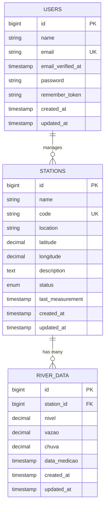

# 🌊 Monitor Rio Piracicaba

[](https://laravel.com)
[](https://php.net)
[](https://sqlite.org)
[](https://reactjs.org)
[](https://tailwindcss.com)
[](https://docker.com)
[](LICENSE)

> **Sistema de monitoramento hidrológico em tempo real** para o Rio Piracicaba e afluentes no Vale do Aço, Minas Gerais. Desenvolvido com Laravel 11 e integração direta com a API oficial da Agência Nacional de Águas e Saneamento Básico (ANA).

## 📺 Demonstração do Projeto

[](https://www.youtube.com/watch?v=3F1Mv8auoHs)

**🎬 [Assista ao vídeo completo do projeto](https://www.youtube.com/watch?v=3F1Mv8auoHs)**

---

## 📋 Índice

- [Visão Geral](#-visão-geral)
- [Objetivos e Importância](#-objetivos-e-importância)
- [Tecnologias e Arquitetura](#-tecnologias-e-arquitetura)
- [Modelo de Dados](#-modelo-de-dados)
- [API Endpoints](#-api-endpoints)
- [Integração com ANA](#-integração-com-ana)
- [Instalação](#-instalação)
- [Deploy](#-deploy)
- [Funcionalidades](#-funcionalidades)
- [Monitoramento](#-monitoramento)
- [Contribuição](#-contribuição)
- [Agradecimentos](#-agradecimentos)
- [Contato](#-contato)
- [Licença](#-licença)

---

## 🎯 Visão Geral

O **Monitor Rio Piracicaba** é uma aplicação web moderna e robusta desenvolvida para monitoramento hidrológico em tempo real do Rio Piracicaba e seus afluentes na região do Vale do Aço, Minas Gerais. O sistema integra dados oficiais da Agência Nacional de Águas (ANA) com uma interface intuitiva e responsiva, proporcionando acesso fácil e rápido a informações críticas sobre níveis de água, vazões e precipitação.

### 🌟 Características Principais

- **🔄 Tempo Real**: Atualização automática de dados hidrológicos
- **📊 Analytics Avançados**: Estatísticas e tendências hidrológicas
- **🌐 API Integrada**: Conexão direta com dados oficiais da ANA
- **📱 Interface Responsiva**: Design moderno e mobile-first
- **🚀 Performance**: Cache inteligente e otimizações
- **🔒 Confiabilidade**: Sistema de fallback com dados mock

---

## 🎯 Objetivos e Importância

### 🎯 **Objetivos do Projeto**

1. **Monitoramento Contínuo**: Fornecer dados hidrológicos atualizados do Rio Piracicaba
2. **Prevenção de Riscos**: Alertar sobre níveis críticos e possíveis enchentes
3. **Gestão de Recursos**: Auxiliar na gestão sustentável dos recursos hídricos
4. **Transparência**: Disponibilizar informações públicas de forma acessível
5. **Educação Ambiental**: Promover conscientização sobre recursos hídricos

### 🌍 **Importância do Projeto**

O Rio Piracicaba é fundamental para o desenvolvimento socioeconômico do Vale do Aço, sendo utilizado para:

- **🏭 Abastecimento Industrial**: Usiminas, ArcelorMittal e outras indústrias
- **🏠 Abastecimento Público**: Milhares de famílias dependem do rio
- **🌾 Irrigação Agrícola**: Suporte à produção agrícola regional
- **⚡ Geração de Energia**: Pequenas centrais hidrelétricas
- **🐟 Preservação Ecológica**: Manutenção do ecossistema aquático

**Monitorar este recurso vital é essencial para a sustentabilidade e segurança da região.**

---

## 🏗️ Tecnologias e Arquitetura

### 🛠️ **Stack Tecnológico**

#### **Backend**

- **Laravel 11** - Framework PHP moderno e robusto
- **PHP 8.1+** - Linguagem de programação server-side
- **SQLite** - Banco de dados leve e eficiente
- **Composer** - Gerenciador de dependências PHP

#### **Frontend**

- **React 19** - Biblioteca JavaScript para interfaces
- **Inertia.js** - Bridge entre Laravel e React
- **TypeScript** - JavaScript com tipagem estática
- **Tailwind CSS 4.0** - Framework CSS utility-first
- **Chart.js** - Biblioteca para gráficos interativos

#### **DevOps e Deploy**

- **Docker** - Containerização da aplicação
- **Nginx** - Servidor web e proxy reverso
- **GitHub Actions** - CI/CD automatizado
- **Fly.io** - Plataforma de deploy cloud
- **Certbot** - Certificados SSL/TLS automáticos

### 🏛️ **Arquitetura do Sistema**

```
┌─────────────────────────────────────────────────────────────┐
│                    CAMADA DE APRESENTAÇÃO                   │
├─────────────────────────────────────────────────────────────┤
│  Frontend (React + Inertia.js + Tailwind CSS)              │
│  • Dashboard Responsivo                                     │
│  • Gráficos Interativos (Chart.js)                         │
│  • Componentes Reutilizáveis                               │
│  • PWA Ready                                               │
└─────────────────────────────────────────────────────────────┘
                                │
                                ▼
┌─────────────────────────────────────────────────────────────┐
│                    CAMADA DE APLICAÇÃO                      │
├─────────────────────────────────────────────────────────────┤
│  Controllers (Laravel)                                      │
│  • DashboardController                                      │
│  • DataController                                           │
│  • AnalyticsController                                      │
│  • StationController                                        │
│  • RiverDataController                                      │
└─────────────────────────────────────────────────────────────┘
                                │
                                ▼
┌─────────────────────────────────────────────────────────────┐
│                    CAMADA DE SERVIÇOS                       │
├─────────────────────────────────────────────────────────────┤
│  Services (Business Logic)                                  │
│  • AnaApiService (Integração ANA)                          │
│  • DataProcessingService                                    │
│  • CacheService                                             │
│  • NotificationService                                      │
└─────────────────────────────────────────────────────────────┘
                                │
                                ▼
┌─────────────────────────────────────────────────────────────┐
│                    CAMADA DE DADOS                          │
├─────────────────────────────────────────────────────────────┤
│  Models & Database                                          │
│  • Station (Estações Hidrológicas)                         │
│  • RiverData (Dados Hidrológicos)                          │
│  • SQLite Database                                          │
│  • Cache (Redis/File)                                       │
└─────────────────────────────────────────────────────────────┘
                                │
                                ▼
┌─────────────────────────────────────────────────────────────┐
│                    INTEGRAÇÃO EXTERNA                       │
├─────────────────────────────────────────────────────────────┤
│  API da ANA (Agência Nacional de Águas)                    │
│  • HidroWebService                                          │
│  • Autenticação OAuth                                       │
│  • Dados em Tempo Real                                      │
│  • Fallback para Dados Mock                                 │
└─────────────────────────────────────────────────────────────┘
```

### 🔄 **Padrões Arquiteturais**

- **MVC (Model-View-Controller)** - Separação clara de responsabilidades
- **Repository Pattern** - Abstração da camada de dados
- **Service Layer** - Lógica de negócio centralizada
- **API Gateway** - Integração padronizada com serviços externos
- **Cache Strategy** - Otimização de performance
- **Error Handling** - Tratamento robusto de erros

---

## 🗄️ Modelo de Dados

### 📊 **Diagrama ER (Entity-Relationship)**



### 📋 **Descrição das Entidades**

#### **🏭 STATIONS (Estações Hidrológicas)**

- **`id`**: Identificador único da estação
- **`name`**: Nome da estação (ex: "Rio Piracicaba - Estação Centro")
- **`code`**: Código único da estação na ANA
- **`location`**: Localização geográfica da estação
- **`latitude/longitude`**: Coordenadas GPS precisas
- **`status`**: Status operacional (active, inactive, maintenance)
- **`last_measurement`**: Timestamp da última medição

#### **📊 RIVER_DATA (Dados Hidrológicos)**

- **`id`**: Identificador único do registro
- **`station_id`**: Referência à estação (FK)
- **`nivel`**: Nível do rio em metros
- **`vazao`**: Vazão em m³/s
- **`chuva`**: Precipitação em mm
- **`data_medicao`**: Timestamp da medição

### 🔗 **Relacionamentos**

- **1:N** - Uma estação pode ter múltiplos registros de dados
- **Cascade Delete** - Exclusão em cascata para manter integridade
- **Índices Otimizados** - Performance em consultas temporais

---

## 🔌 API Endpoints

### 📡 **Endpoints Principais**

#### **🏠 Dashboard e Navegação**

```http
GET  /                    # Dashboard principal
GET  /stations           # Lista de estações
GET  /data               # Visualização de dados
GET  /analytics          # Análises e estatísticas
```

#### **📊 API de Dados Hidrológicos**

```http
GET  /api/river-data                    # Lista dados hidrológicos
GET  /api/river-data/chart              # Dados para gráficos
GET  /api/river-data/stats              # Estatísticas consolidadas
POST /api/river-data                    # Criar novo registro
GET  /api/river-data/{id}               # Obter dados específicos
PUT  /api/river-data/{id}               # Atualizar dados
DELETE /api/river-data/{id}             # Excluir dados
```

#### **🏭 API de Estações**

```http
GET  /api/stations                      # Lista todas as estações
GET  /api/stations/discover-piracicaba  # Descobrir estações do Piracicaba
```

#### **🌐 Integração com ANA**

```http
POST /api/ana/fetch                     # Buscar dados da ANA
POST /api/ana/refresh-station           # Atualizar estação específica
```

#### **💚 Health Check**

```http
GET  /health                           # Status da aplicação
GET  /health/detailed                  # Status detalhado
```

### 📝 **Exemplos de Resposta**

#### **GET /api/river-data**

```json
{
    "data": [
        {
            "id": 1,
            "station_id": 1,
            "nivel": 2.45,
            "vazao": 15.2,
            "chuva": 0.5,
            "data_medicao": "2024-09-20T12:00:00Z",
            "station": {
                "id": 1,
                "name": "Rio Piracicaba - Estação Centro",
                "code": "PIR001",
                "location": "Ipatinga, MG"
            }
        }
    ],
    "meta": {
        "total": 150,
        "per_page": 25,
        "current_page": 1
    }
}
```

#### **GET /health**

```json
{
    "status": "healthy",
    "timestamp": "2024-09-20T12:00:00Z",
    "database": "connected",
    "cache": "working",
    "storage": "writable",
    "version": "1.3.0",
    "environment": "production"
}
```

---

## 🌐 Integração com ANA

### 🏛️ **Sobre a Agência Nacional de Águas (ANA)**

A **ANA** é a agência reguladora federal responsável pela implementação da gestão de recursos hídricos no Brasil. Fundada em 2000, a ANA coordena o Sistema Nacional de Gerenciamento de Recursos Hídricos e mantém uma rede nacional de estações hidrológicas.

### 🔌 **API HidroWebService**

O sistema integra com a **API oficial da ANA** através do HidroWebService:

#### **🔐 Autenticação**

```php
// Configuração de autenticação
'base_url' => 'https://www.ana.gov.br/hidrowebservice',
'auth' => [
    'identificador' => env('ANA_API_IDENTIFICADOR'),
    'senha' => env('ANA_API_SENHA'),
    'token_ttl' => 3600 // 1 hora
]
```

#### **📡 Endpoints Utilizados**

- **`/EstacoesTelemetricas/OAUth/v1`** - Autenticação
- **`/EstacoesTelemetricas/HidroInventarioEstacoes/v1`** - Inventário de estações
- **`/EstacoesTelemetricas/HidroSerieCotas/v1`** - Dados de cotas/níveis
- **`/EstacoesTelemetricas/HidroSerieVazao/v1`** - Dados de vazão
- **`/EstacoesTelemetricas/HidroSerieChuva/v1`** - Dados de chuva

#### **🎯 Estações do Rio Piracicaba Monitoradas**

- **Estação Vale do Aço** - Principal estação industrial
- **Estação Centro** - Área urbana de Ipatinga
- **Estação Zona Rural** - Monitoramento agrícola

### ⚡ **Recursos da Integração**

- **🔄 Cache Inteligente**: Reduz chamadas desnecessárias à API
- **🛡️ Retry Logic**: Tentativas automáticas em caso de falha
- **📊 Fallback**: Dados mock quando API indisponível
- **📈 Rate Limiting**: Respeita limites da API
- **🔍 Logging**: Monitoramento completo das integrações

---

## 🚀 Instalação

### 📋 **Pré-requisitos**

- **PHP 8.1+** com extensões: pdo, pdo_sqlite, mbstring, xml, curl, zip, gd, intl
- **Composer 2.0+**
- **Node.js 18+** e **npm**
- **SQLite 3**
- **Git**

### ⚡ **Instalação Rápida**

```bash
# 1. Clone o repositório
git clone https://github.com/Wil-JC-Pimenta/monitor-rio.git
cd monitor-rio

# 2. Instale dependências PHP
composer install

# 3. Instale dependências Node.js
npm install

# 4. Configure o ambiente
cp .env.example .env
php artisan key:generate

# 5. Configure banco de dados
touch database/database.sqlite
php artisan migrate

# 6. Compile assets
npm run build

# 7. Inicie o servidor
php artisan serve
```

### 🐳 **Instalação com Docker**

```bash
# 1. Clone e navegue para o projeto
git clone https://github.com/Wil-JC-Pimenta/monitor-rio.git
cd monitor-rio

# 2. Execute com Docker Compose
docker-compose up -d

# 3. Acesse a aplicação
open http://localhost:8000
```

### 🔧 **Configuração Detalhada**

#### **Variáveis de Ambiente (.env)**

```env
# Aplicação
APP_NAME="Monitor Rio Piracicaba"
APP_ENV=local
APP_KEY=base64:...
APP_DEBUG=true
APP_URL=http://localhost:8000

# Banco de Dados
DB_CONNECTION=sqlite
DB_DATABASE=database/database.sqlite

# Cache
CACHE_STORE=file
SESSION_DRIVER=file
QUEUE_CONNECTION=sync

# API ANA
ANA_API_BASE_URL=https://www.ana.gov.br/hidrowebservice
ANA_API_IDENTIFICADOR=seu_identificador
ANA_API_SENHA=sua_senha
ANA_CACHE_ENABLED=true
ANA_CACHE_TTL=3600
```

---

## 🌐 Deploy

### 🚀 **Deploy no Fly.io (Recomendado)**

```bash
# 1. Instale o Fly CLI
curl -L https://fly.io/install.sh | sh

# 2. Faça login
fly auth login

# 3. Deploy automático
fly deploy
```

### 🐳 **Deploy com Docker**

```bash
# Build da imagem
docker build -t monitor-rio .

# Execute o container
docker run -p 8000:80 monitor-rio
```

### 🖥️ **Deploy em Servidor VPS**

```bash
# Execute o script de deploy completo
chmod +x scripts/setup-complete.sh
sudo ./scripts/setup-complete.sh
```

### 📋 **Scripts de Deploy Disponíveis**

- **`scripts/install-server.sh`** - Instala dependências do servidor
- **`scripts/configure-nginx.sh`** - Configura Nginx
- **`scripts/configure-ssl.sh`** - Configura HTTPS com Certbot
- **`scripts/configure-services.sh`** - Configura systemd services
- **`scripts/deploy.sh`** - Deploy contínuo automatizado

---

## ⚙️ Funcionalidades

### 🏠 **Dashboard Principal**

- **📊 Métricas em Tempo Real**: Níveis, vazões e precipitação
- **📈 Gráficos Interativos**: Visualizações temporais
- **🚨 Alertas**: Notificações de níveis críticos
- **📱 Design Responsivo**: Funciona em todos os dispositivos

### 🏭 **Gestão de Estações**

- **📍 Localização GPS**: Coordenadas precisas
- **📊 Status Operacional**: Monitoramento de saúde
- **📈 Histórico**: Dados históricos completos
- **🔍 Busca Avançada**: Filtros e ordenação

### 📊 **Análises e Estatísticas**

- **📈 Tendências**: Análise de padrões temporais
- **📊 Comparativos**: Análise entre estações
- **📋 Relatórios**: Exportação de dados
- **🎯 Alertas Personalizados**: Configuração de limites

### 🔄 **Sincronização Automática**

- **⏰ Agendamento**: Atualizações programadas
- **🔄 Real-time**: Dados em tempo real
- **📱 Notificações**: Alertas push
- **📧 Email**: Relatórios periódicos

---

## 📊 Monitoramento

### 💚 **Health Checks**

#### **Endpoint Básico**

```http
GET /health
```

#### **Endpoint Detalhado**

```http
GET /health/detailed
```

### 📈 **Métricas Monitoradas**

- **🗄️ Database**: Status da conexão SQLite
- **💾 Cache**: Funcionamento do sistema de cache
- **📁 Storage**: Permissões de escrita
- **🌐 API ANA**: Status da integração
- **⚡ Performance**: Tempo de resposta

### 🔍 **Logs e Debugging**

```bash
# Visualizar logs da aplicação
tail -f storage/logs/laravel.log

# Logs específicos da ANA
tail -f storage/logs/ana-api.log

# Debug de performance
php artisan telescope
```

---

## 🤝 Contribuição

### 🛠️ **Como Contribuir**

1. **🍴 Fork** o projeto
2. **🌿 Crie** uma branch para sua feature (`git checkout -b feature/AmazingFeature`)
3. **💾 Commit** suas mudanças (`git commit -m 'Add some AmazingFeature'`)
4. **📤 Push** para a branch (`git push origin feature/AmazingFeature`)
5. **🔄 Abra** um Pull Request

### 📋 **Padrões de Código**

- **PSR-12** para PHP
- **ESLint + Prettier** para JavaScript/TypeScript
- **Conventional Commits** para mensagens de commit
- **Testes** obrigatórios para novas funcionalidades

### 🧪 **Executar Testes**

```bash
# Testes PHP
php artisan test

# Testes com coverage
php artisan test --coverage

# Testes JavaScript
npm test
```

---

### 🛠️ **Ferramentas e Bibliotecas**

- **Laravel Framework** - Base sólida para o desenvolvimento
- **React & Inertia.js** - Interface moderna e responsiva
- **Tailwind CSS** - Design system eficiente
- **Chart.js** - Visualizações interativas
- **Docker** - Containerização e deploy

---

## 📞 Contato

### 👨‍💻 **Desenvolvedor**

**Wilker Junio Coelho Pimenta**

- 📧 **Email**: wiljcpimenta@gmail.com
- 💼 **LinkedIn**: [Wilker Pimenta](https://linkedin.com/in/wilker-j-c-pimenta)
- 🐙 **GitHub**: [@Wil-JC-Pimenta](https://github.com/Wil-JC-Pimenta)
- 🌐 **Portfolio**: [wilkerpimenta.dev](https://wilker-pimenta.vercel.app/)

---

## 📄 Licença

Este projeto está licenciado sob a **Licença MIT** - veja o arquivo [LICENSE](LICENSE) para detalhes.

### 📋 **Resumo da Licença**

```
MIT License

Copyright (c) 2024 Wilker Junio Coelho Pimenta

Permission is hereby granted, free of charge, to any person obtaining a copy
of this software and associated documentation files (the "Software"), to deal
in the Software without restriction, including without limitation the rights
to use, copy, modify, merge, publish, distribute, sublicense, and/or sell
copies of the Software, and to permit persons to whom the Software is
furnished to do so, subject to the following conditions:

The above copyright notice and this permission notice shall be included in all
copies or substantial portions of the Software.

THE SOFTWARE IS PROVIDED "AS IS", WITHOUT WARRANTY OF ANY KIND, EXPRESS OR
IMPLIED, INCLUDING BUT NOT LIMITED TO THE WARRANTIES OF MERCHANTABILITY,
FITNESS FOR A PARTICULAR PURPOSE AND NONINFRINGEMENT. IN NO EVENT SHALL THE
AUTHORS OR COPYRIGHT HOLDERS BE LIABLE FOR ANY CLAIM, DAMAGES OR OTHER
LIABILITY, WHETHER IN AN ACTION OF CONTRACT, TORT OR OTHERWISE, ARISING FROM,
OUT OF OR IN CONNECTION WITH THE SOFTWARE OR THE USE OR OTHER DEALINGS IN THE
SOFTWARE.
```

## 🏆 Status do Projeto


### 📊 **Métricas do Projeto**

- **📅 Última Atualização**: Setembro 2025
- **🔢 Versão Atual**: 1.3.0
- **📈 Status**: Ativo e em desenvolvimento
- **🎯 Próximos Passos**: Deploy em produção e monitoramento avançado

---

<div align="center">

**🌊 Desenvolvido com ❤️ para o Vale do Aço, Minas Gerais**

_Sistema de monitoramento hidrológico em tempo real do Rio Piracicaba_

[](https://laravel.com)
[](https://reactjs.org)
[](https://www.ana.gov.br)

</div>
